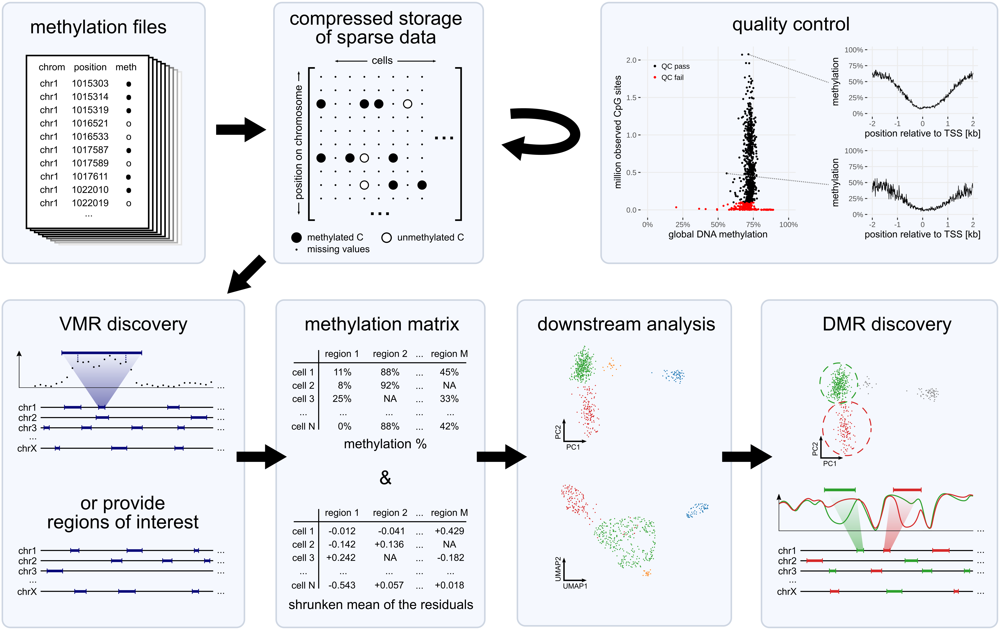

# `scbs`: A Command Line Tool for the Analysis of Single-Cell Bisulfite-Sequencing Data

## Installation

You can install `scbs` from the Python package index as follows:
```
python3 -m pip install --upgrade pip  # you need a recent pip version
python3 -m pip install scbs
```
Then restart your terminal. The installation is now finished and the command line interface should now be available when typing the command `scbs` in your terminal.
If this is not the case, check the "troubleshooting" section below.  


## Updating to the latest version
Just use `--upgrade` when installing the package, otherwise it's the same process as installing:
```
python3 -m pip install --upgrade scbs
```
Afterwards, make sure that the latest version is correctly installed:
```
scbs --version
```

## [Tutorial](docs/tutorial.md) of a typical `scbs` run
A tutorial can be found [here](docs/tutorial.md).

Also make sure to read the help by typing `scbs --help` or by checking [this page](docs/commands.md).


## What can this package do?

`scbs` takes as input a number of single-cell methylation files and allows you to quickly and easily obtain a cell × region matrix for downstream analysis.
It also facilitates quality control, allows you to discover variably methylated regions (VMRs), accurately quantifies methylation in genomic intervals, and stores your sc-methylomes in an efficient manner.



You can find a list of the available `scbs` commands [here](docs/commands.md).


## Troubleshooting

#### Installation issues

Carefully check the output log of PIP. Look for a message like `WARNING: The script scbs is installed in '/home/ubuntu/.local/bin' which is not on PATH.`, which would indicate that you need to add `/home/ubuntu/.local/bin` to your path. Alternatively, you can copy `/home/ubuntu/.local/bin/scbs` to e.g. `/usr/local/bin`.

If you encounter other problems during installation, make sure you have Python3.8 or higher, and make sure you have the latest PIP version. If the problem persists, consider installing `scbs` in a clean Python environment (for example using [venv](https://docs.python.org/3/library/venv.html)).

#### Too many open files
If you encounter a "too many open files" error during `scbs prepare` (`OSError: [Errno 24] Too many open files`), you need to increase the maximum number of files that can be opened. In Unix systems, try `ulimit -n 9999`.


## Contributors
- [Lukas PM Kremer](https://github.com/LKremer)
- [Leonie Küchenhoff](https://github.com/LeonieKuechenhoff)
- [Alexey Uvarovskii](https://github.com/alexey0308)
- [Simon Anders](https://github.com/simon-anders)
