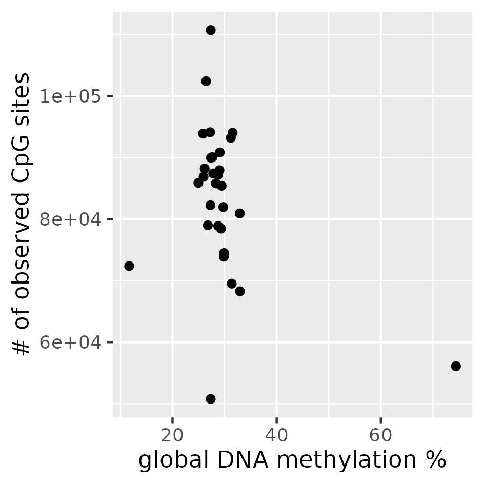
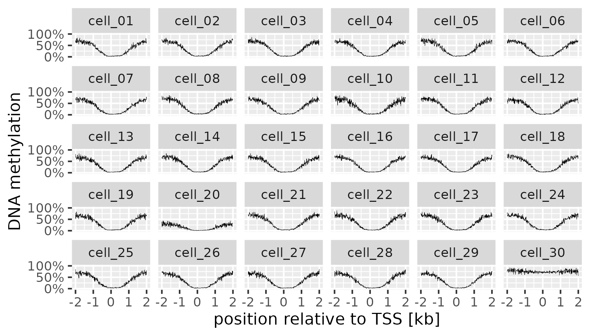
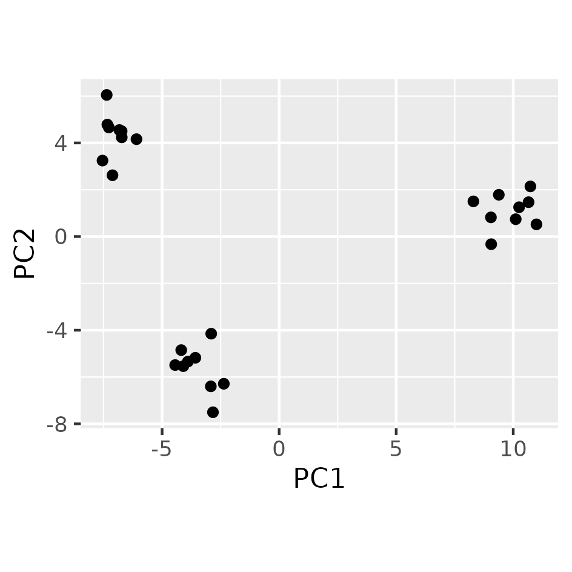
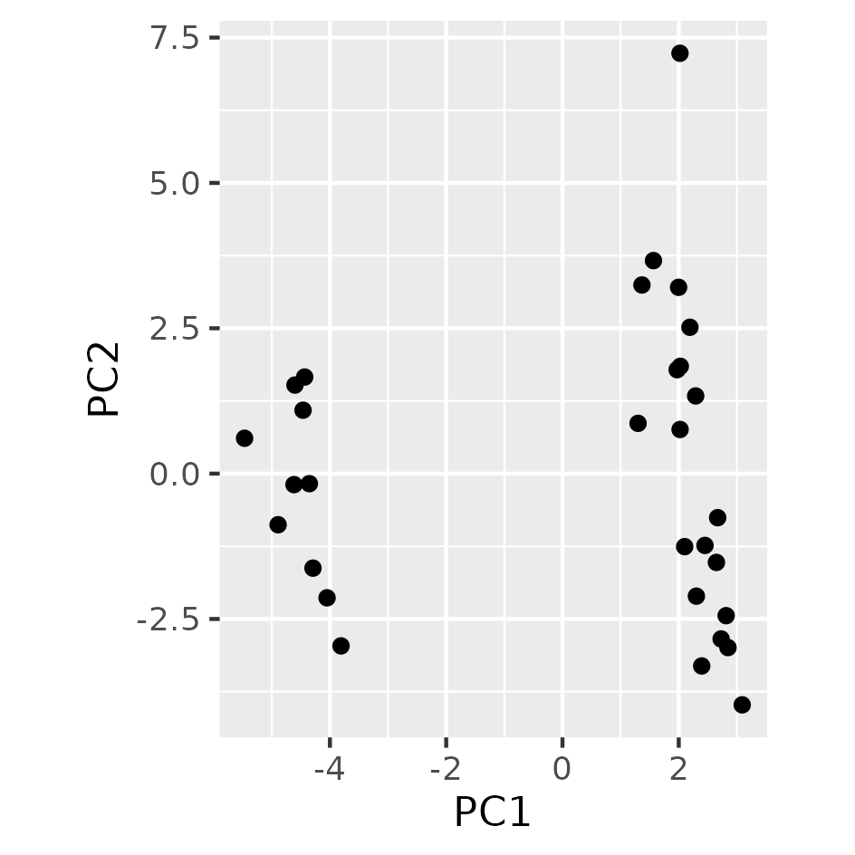

# Tutorial

## Usage principles

`scbs` provides a number of commands.
To view the available commands, simply install `scbs` and then type `scbs --help` (or just `scbs`) in your terminal.
Similarly, you can use `scbs [command] --help` to learn about each command and their arguments.
For example, use `scbs prepare --help` to learn how to use the `prepare` command.

A typical `scbs` workflow consists of the following steps which will be explained in the course of this tutorial:
1. use `scbs prepare` to store single-cell methylation data in an efficient format
2. use `scbs filter` to filter low-quality cells
3. use `scbs scan` to discover methylation-variable regions in the genome, or alternatively provide your own regions of interest
4. use `scbs matrix` to receive a methylation matrix analogous to the count matrix in scRNA-seq
5. use the methylation matrix for downstream analysis such as dimensionality reduction and clustering


### What you will need

`scbs` assumes that you
- used single-cell bisulfite-sequencing (scBS) to generate FASTQ-files of bisulfite-converted reads
- mapped the reads with a methylation-aware program
- extracted context-dependent methylation values (typically CpG) from the alignments

The last two steps can be achieved with bulk bisulfite-sequencing tools such as [Bismark](https://www.bioinformatics.babraham.ac.uk/projects/bismark/) and the included `bismark_methylation_extractor` script.
Afterwards, you should be left with a simple tabular file for each cell.
Each file contains the methylation status of thousands of methylation sites (typically CpG-sites) in the whole genome.
Here are the first five lines of an example file, which is a `.cov`-file generated by Bismark:

```
1       100021800       100021800       100.000000      1       0
1       100023064       100023064       0.000000        0       1
1       100026855       100026855       100.000000      1       0
1       100027218       100027218       100.000000      2       0
1       100051671       100051671       0.000000        0       2
```

You should have one of these files per cell.

The columns denote the chromosome name, the start and end coordinates of the methylation site (identical in this case), the observed percentage of methylation (typically 0% or 100% in single-cell data), the number of reads that are methylated at that site, and the number of unmethylated reads.
If you did not use Bismark and your files have a slightly different format, don't worry.
We support a range of different input formats and you can even define your own custom format.

`scbs` supports both uncompressed and gzip-compressed input files, as long as any gzipped files end in `.gz`.


## Download our tutorial data set

In this tutorial, we will analyze a small example data set with just 30 cells. If you want to follow along and try it yourself, you can download the data here:
[scbs_tutorial_data.tar.gz](https://heibox.uni-heidelberg.de/f/0a74cc5fd8a141a4bab8/?dl=1) and unpack it with `tar -xvzf scbs_tutorial_data.tar.gz`.


### 1. Preparing your `scbs` run

The first step of any `scbs` workflow is to collect the methylation data of all single-cell files in order to store it in a more efficient format.
This can be achieved with the commands `scbs prepare` and `scbs smooth`:

```bash
scbs prepare scbs_tutorial_data/*.cov compact_data
scbs smooth compact_data
```

This command will take all files ending in `.cov` in the `scbs_tutorial_data` directory and efficiently store their methylation values in a new directory called `compact_data`.
`scbs prepare` is the only step that requires the raw data, all other `scbs` commands work directly with `compact_data`.
If you're working with your own data and you sequenced thousands of cells, `scbs prepare` will take quite long. But fortunately, you only have to run it once in the very beginning.


### 2. Filtering low-quality cells

Due to various technical issues such as empty wells / droplets and incomplete bisulfite conversion, every scBS experiment comes with a hopefully small number of low-quality cells.
It is recommended to identify and remove these cells before proceeding with the analysis.
In this tutorial we will look at three quality measures:
1. The number of observed methylation sites (this usually depends on the read number)
2. The global methylation percentage
3. The average methylation profile of transcription start sites

Measures 1 and 2 can be found in `compact_data/cell_stats.csv`.
You can easily visualize these quality measures using a method of your choice.
Here we use R:

```r
library(tidyverse)

cell_stats <- read_csv("compact_data/cell_stats.csv")

cell_stats %>% 
  ggplot(aes(x = global_meth_frac * 100, y = n_obs)) +
  geom_point() +
  labs(x = "global DNA methylation %", y = "# of observed CpG sites")
```



You can clearly see that there are three outlier cells, characterized by a low number of observed CpG sites or an unusual global methylation percentage.
Note that we're dealing with a small toy data set here, and the numbers will look quite different in a real experiment!

Finally, we also inspect the average methylation profile around transcription start sites (TSS) for every cell.
Why?
Our tutorial data set consists of mouse cells, and it is known that DNA methylation is globally high in mouse, but low around TSS.
Every cell that strongly deviates from this expectation is suspicous and a candidate for filtering, so we use `scbs profile` to help visualize the average methylation around TSS:
```bash
scbs profile --strand-column 6 scbs_tutorial_data/Mus_musculus.GRCm38.102_TSS.bed compact_data TSS_profile.csv
```
Again, we can use R or any other language to inspect the TSS profiles:
```r
profile_df <- read_csv("TSS_profile.csv") %>% 
  mutate(position_binned = round(position, -1L)) %>% 
  group_by(position_binned, cell_name) %>% 
  summarise(meth_frac = mean(meth_frac)) %>% 
  ungroup()

profile_df %>% 
  ggplot(aes(x = position_binned / 1000, y = meth_frac)) +
  scale_y_continuous(labels=scales::percent_format(accuracy=1), limits=c(0, 1), breaks=c(0, .5, 1)) +
  geom_line(size=.1) +
  facet_wrap(~cell_name) +
  labs(x = "position relative to TSS [kb]", y = "DNA methylation")
```



There are only two cells that have a suspicous profile: `cell_20` and `cell_30`.
If you dig into the data yourself, you will find that these two cells are among the three outliers in our previous plot.
However, in a real data set you might also discover cells that have good quality measures, but a poor TSS profile.
Let's filter all three low-quality cells from the data set:
```bash
scbs filter --min-sites 60000 --min-meth 20 --max-meth 60 compact_data filtered_data
```
This command removes cells with less than 60,000 observed methylation sites, less than 20% global methylation, and more than 60% global methylation (these values would look very different in a real experiment).
If you want full control over which cells will be filtered, you can also select cells by their name.
See `scbs filter --help` for details.

We can now proceed with the quality-filtered data, stored in `filtered_data`.


### 3. Discovering methylation-variable regions

The starting point of every single-cell RNA-seq analysis is a gene × cell (or cell × gene) count matrix that can be used for downstream analyses such as dimensionality reduction or clustering.
But single-cell methylation data is genome-wide and not limited to genes, hence we need to define genomic regions of interest.
A common strategy is to simply quantify methylation at promoters or gene bodies.
But not all methylation differences occur at promoters or gene bodies, hence we propose to discover methylation-variable regions (MVRs) in the data itself.
This can be achieved with `scbs scan`.

Before you can run `scbs scan` for the first time, you will need to run `scbs smooth` once.
This command simply calculates treats all your single cells as a pseudo-bulk sample and calculates the smoothed mean methylation along the whole genome.
This information is required for MVR detection, and later, for obtaining a methylation matrix.

```bash
scbs smooth filtered_data
```

Now that `filtered_data` is smoothed, we can proceed with the MVR detection:

```bash
scbs scan --threads 4 filtered_data MVRs.bed
```
We use the option `--threads 4` in order to run the program on 4 CPU threads in parallel. If you want to use all available threads, simply omit the `--threads` option altogether.
The result is a [BED-file](https://en.wikipedia.org/wiki/BED_(file_format)) that lists the genomic coordinates (chromosome, start, end) of regions where methylation is variable between cells, as well as the methylation variance of the region:
```
2       3194798 3197978 0.07718534715010719
2       3379038 3381638 0.08048814475349723
2       4295158 4299148 0.06783578568141418
2       4443928 4446178 0.07310900984059789
2       4544208 4546518 0.08275669639137119
...
```


### 4. Getting a methylation matrix

Finally, you can quantify the mean methylation of the MVRs that we just discovered using `scbs matrix`:
```bash
scbs matrix MVRs.bed filtered_data MVR_matrix.csv
```
The result is a long table that lists the average methylation of all regions (here: MVRs) in all cells. We report two measures of methylation: the average methylation (`meth_frac`) and the shrunken residuals (`shrunken_residual`), which are less affected by random variations in read coverage and read positioning within the region.
This table is currently in [narrow table format](https://en.wikipedia.org/wiki/Wide_and_narrow_data) (also called long table format), which means that every row contains the information of one region in a specific cell:


| chromosome | start   | end     | n_sites | n_cells | cell_name | n_meth | n_obs | meth_frac | shrunken_residual   |
| ---------- | ------- | ------- | ------- | ------- | --------- | ------ | ----- | --------- | ------------------- |
| 2          | 3194798 | 3197978 | 19      | 14      | cell_01   | 1      | 1     | 1.0       | 0.2733494383016978  |
| 2          | 3194798 | 3197978 | 19      | 14      | cell_04   | 5      | 5     | 1.0       | 0.34927947513611973 |
| 2          | 3194798 | 3197978 | 19      | 14      | cell_05   | 2      | 2     | 1.0       | 0.4367514666223647  |
| 2          | 3194798 | 3197978 | 19      | 14      | cell_08   | 2      | 2     | 1.0       | 0.1101753329826048  |
| 2          | 3194798 | 3197978 | 19      | 14      | cell_12   | 1      | 10    | 0.1       | -0.3877691051698608 |
| ...        |         |         |         |         |           |        |       |           |                     |

This methylation matrix can now be used to distinguish different cell types in the sample, perform PCA and/or UMAP, or perform clustering.

If you want, you can also get a methylation matrix of specific genomic features that you are interested in.
For example, here we quantify methylation of promoters in the mouse genome:
```bash
scbs matrix scbs_tutorial_data/mouse_promoters.bed filtered_data promoter_matrix.csv
```


### 5. Downstream analysis

Now we can import our methylation matrix into a scripting language of our choice for downstream analysis.
In this tutorial, we chose to use R.
We read the matrix and create a new column `region` that denotes the genomic coordinates of each region.
Next, we pivot the matrix from the long table format into a standard cell × region format.
Here we chose to use the shrunken residuals as our measure of methylation.
Finally, we transform the dataframe into a matrix.

```r
library(tidyverse)
library(irlba)

meth_mtx <- read_csv("MVR_matrix.csv") %>% 
  unite("region", c("chromosome", "start", "end")) %>% 
  pivot_wider("cell_name", names_from = "region", values_from = "shrunken_residual") %>% 
  column_to_rownames(var="cell_name") %>% 
  as.matrix()
```

The methylation matrix is similar to a scRNA-seq count matrix, but one major difference is that it contains missing values.
This is because the coverage of every single cell is low, which means that there are plenty of genomic intervals that did not receive a single sequencing read.
To counter this, we propose a simple and straightforward way to deal with missing data in the input matrix to a PCA: In a first iteration, we replace each missing value in the centered input matrix with zero, then run the PCA. Then, these zeroes are replaced by the value predicted by the PCA and the PCA is rerun.

Below, you can find an R function that implements this approach:
```r
# PCA that iteratively imputes missing values
prcomp_iterative <- function(x, n=10, n_iter=100, min_gain=0.01, ...) {
  mse <- rep(NA, n_iter)
  na_loc <- is.na(x)
  x[na_loc] = 0  # zero is our first guess

  for (i in 1:n_iter) {
    prev_imp <- x[na_loc]  # what we imputed in the previous round
    # PCA on the imputed matrix
    pr <- prcomp_irlba(x, center = F, scale. = F, n = n, ...)
    # impute missing values with PCA
    new_imp <- (pr$x %*% t(pr$rotation))[na_loc]
    x[na_loc] <- new_imp
    # compare our new imputed values to the ones from the previous round
    mse[i] = mean((prev_imp - new_imp) ^ 2)
    # if the values didn't change a lot, terminate the iteration
    gain <- mse[i] / max(mse, na.rm = T)
    if (gain < min_gain) {
      message(paste(c("\n\nTerminated after ", i, " iterations.")))
      break
    }
  }
  pr$mse_iter <- mse[1:i]
  pr
}
```

We simply run our modified PCA on the centered methylation matrix...
```r
pca <- meth_mtx %>%
  scale(center = T, scale = F) %>%
  prcomp_iterative(n = 5, n_iter = 5)
```

...and then plot the PCA, revealing three cell types with distinct methylomes:
```r
pca$x %>% 
  as_tibble() %>% 
  ggplot(aes(x = PC1, y = PC2)) +
  geom_point() +
  coord_fixed()
```



Of course you can also use PCA on the promoter methylation matrix instead of the MVR matrix by simply loading `promoter_matrix.csv` instead of `MVR_matrix.csv`.
This matrix yields a visually similar PCA, although the three cell types are not as cleanly separated:




### Advanced usage

#### Using stdin and stdout
If you want to use stdin and stdout instead of providing input/output file paths, you can use the `-` character where you would otherwise write the path to the file.
This makes it easy to incorporate other tools such as `bedtools` into your workflows.
For example, consider a workflow where you first want to sort your genomic input regions with `bedtools sort`, then you want to quantify methylation at these regions with `scbs matrix`, and then you want to compress the resulting matrix:
```bash
bedtools sort -i unsorted.bed > sorted.bed
scbs matrix sorted.bed compact_data matrix.csv
gzip matrix.csv
```
Using stdin and stdout, this workflow can be simplified:
```bash
bedtools sort -i unsorted.bed | scbs matrix - compact_data - | gzip > matrix.csv.gz
```
